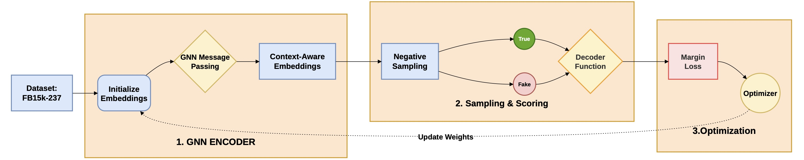

# Knowledge Graph Completion: FB15k-237

## Overview
This repository contains the training and evaluation pipeline for Knowledge Graph Completion (KGC) using the **FB15k-237** dataset. 

The primary task addressed here is **Tail Node Prediction**: given a Head Entity and a Relation, the models are trained to rank the most mathematically plausible Tail Entities from the graph. Model performance is evaluated using standard KGC ranking metrics: **Mean Reciprocal Rank (MRR)** and **Hits@10**.

## Architecture & Pipeline

## How to Use
To run this code, simply open the notebooks in Google Colab (or your preferred environment), update the data paths wherever necessary to point to your own directories, and run the code blocks sequentially.